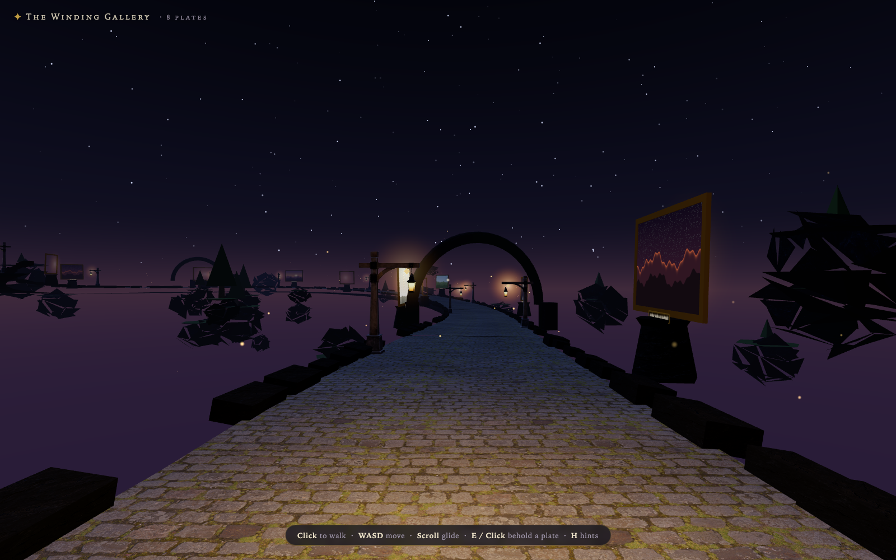
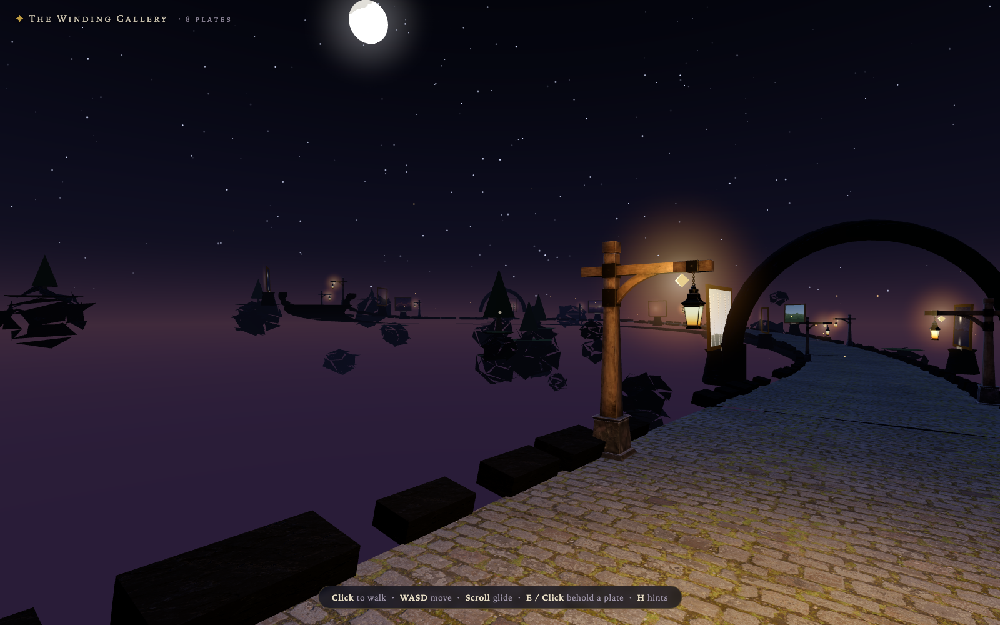
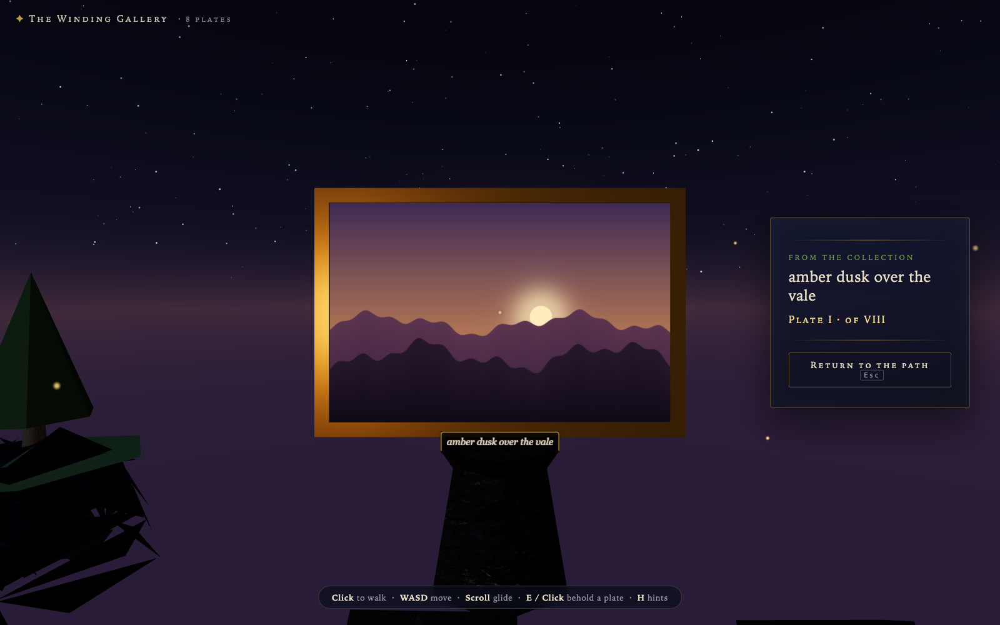
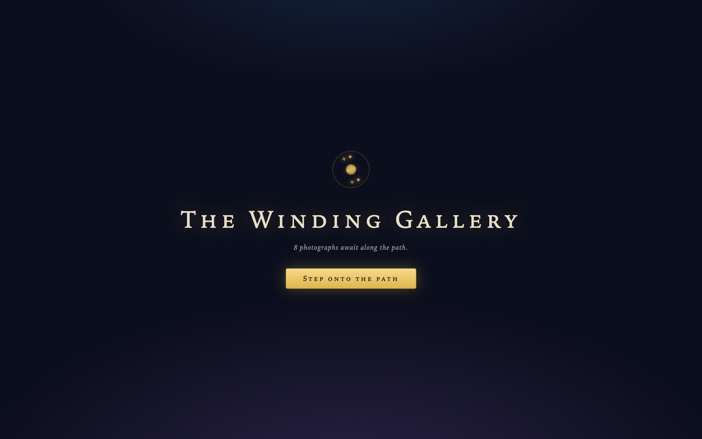

<div align="center">

# 🏮 The Winding Gallery

**Your photographs, hung along an endless winding sky-path.**

A fantasy 3D photo gallery in the browser. Point it at any directory of
photos and walk a moonlit cobblestone causeway adrift among floating
islands — every photograph becomes a gold-framed *plate* on its own
plinth, lit by lanterns and fireflies, with a brass plaque bearing its
name. The path winds and climbs forever, cycling through your collection
as you go.

[](https://github.com/acaylor/the-winding-gallery/actions/workflows/ci.yml)
[](https://www.npmjs.com/package/the-winding-gallery)
[](LICENSE)




</div>

---

## ✨ What is this?

A sibling of [agent-hollow](https://github.com/acaylor/agent-hollow)'s
night realm — a small local web app that turns a folder of photos into a
place you can *walk through*:

- **Every photo → a plate.** Gold-framed, standing on a stone plinth,
  softly aglow in the dark, with a plaque bearing its filename.
- **An endless path.** The causeway is generated ahead of you and
  dissolved behind you, winding and gently climbing forever. When the
  collection runs out, it begins again — the gallery never ends.
- **A place, not a page.** Real CC0 surfaces (mossy cobblestones, rock,
  bark from [ambientCG](https://ambientcg.com)) and the Khronos CC0
  lantern model, under moonlight, starlight and fireflies.

## 🖼️ Gallery

| Walking the path | Beholding a plate |
| --- | --- |
|  |  |

<div align="center">

</div>

## 🚀 Quick start

```sh
npm install

# hang your own photographs (jpg, png, webp, gif, avif, bmp — scanned recursively)
npm start -- ~/Pictures/landscapes

# …or conjure 8 procedural sample plates first and use those
npm run samples
npm start
```

Then open **http://localhost:4173** and *step onto the path*.

Or install globally and point it anywhere:

```sh
npm i -g the-winding-gallery
winding-gallery ~/Pictures/landscapes --port=4173
```

## 🚶 Walking the path

| Input | Action |
| --- | --- |
| **Click** | take hold of the view (pointer lock) |
| **W A S D** / arrows | walk · **Shift** to hurry |
| **Mouse** | look around |
| **Scroll** | glide along the path — works even without clicking in |
| **E** or **Click** on a plate | behold it — the view flies up close, with its name and number |
| **Esc** / **E** / click | return to the path |
| **H** | toggle the hints |

## ⚙️ How it works

- A tiny zero-dependency Node server (`server.js`) scans the photo
  directory (up to 6 levels deep, 5 000 images) and serves the app;
  Three.js is the only npm dependency, served straight from
  `node_modules` — **no build step**.
- The path is a heading integrated over gentle overlapping sine
  curvatures (`public/gallery-math.js`), so it wanders and climbs forever
  without ever knotting. Segments of causeway — cobblestones, curbs,
  plinths, lanterns, arches, drifting rocks — are built ahead of you and
  dissolved behind you.
- Plates cycle through your collection endlessly. Photos are decoded
  off-thread, downscaled to 2048 px, and reference-counted so an infinite
  walk stays lean. Plate numbering is in Roman numerals, as is proper for
  a wizard's collection.
- All bundled art is CC0 — see [ASSETS.md](ASSETS.md).

## 🧪 Development

```sh
npm test          # node --test: path math, server API, PNG conjurer
```

Handy query params: `?auto` skips the entrance veil, `?s=120` starts
120 m down the path, `?yaw=45` turns the starting view, `?behold` flies
to the nearest plate. `window.__winding()` reports walker state for
tooling.

Releases: CI runs the tests on every push; pushing a version tag
(`git tag v0.2.0 && git push --tags`) publishes to npm.

## 📜 License

[MIT](LICENSE). Bundled CC0 assets are catalogued in [ASSETS.md](ASSETS.md).
